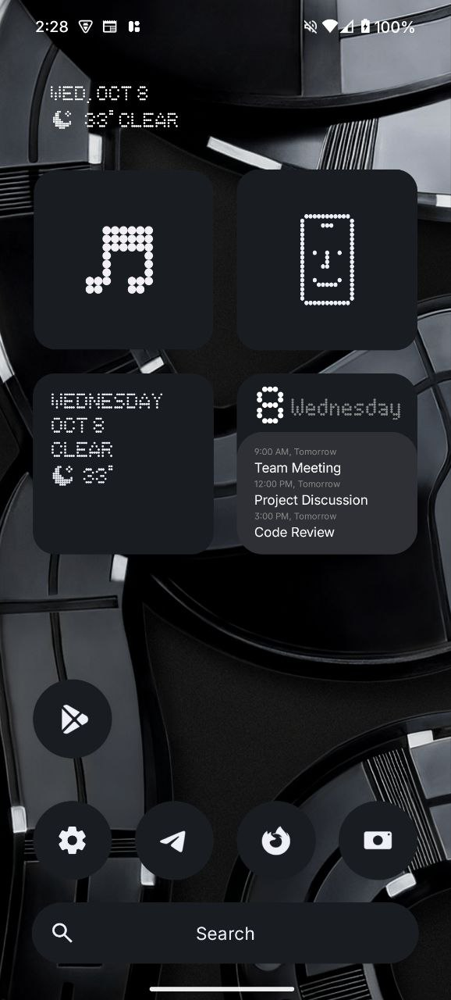
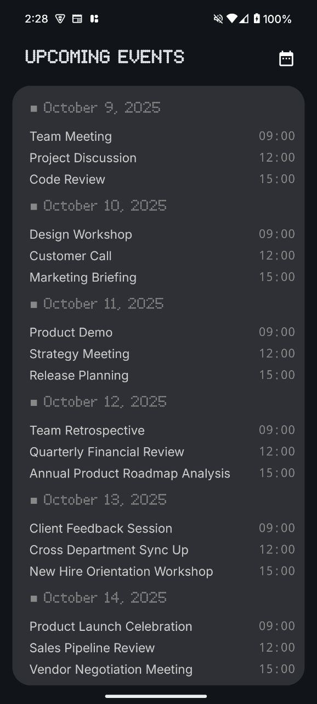

# Nothing Calendar Widget

Nothing Calendar Widget is a minimalist Android calendar widget inspired by the **Nothing Phone** design. It provides a clean, modern look while showing your upcoming events at a glance. The app also includes a single screen that displays all your events for the next 7 days.

## Features

- Minimalist design inspired by Nothing Phone UI
- Home screen widget for quick access to upcoming events
- Single activity displaying events for the next 7 days
- Lightweight and easy to use
- Supports dynamic updates from your device calendar

## Screenshots

